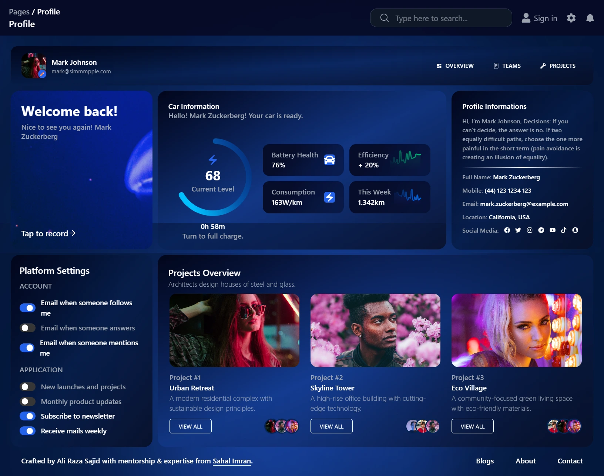

# 🌐 Vision‑Inspired Dashboard

[](https://react.dev/)
[](https://www.typescriptlang.org/)
[](https://tailwindcss.com/)
[](https://vitejs.dev/)
[](https://recharts.org/)
[](./LICENSE)
[](https://github.com/Aliyan-707/Vision-UI-Dashboard.git)
[](https://github.com/Aliyan-707/Vision-UI-Dashboard.git)


---

## 🚀 Overview

A modern, responsive, and dynamic **dashboard UI** inspired by the community **Vision UI Dashboard** Figma template: [link](https://www.figma.com/design/mdBpCc4vlVTEdHlohpwOy2/Vision-UI-Dashboard-React---MUI-Dashboard--Free-Version---Community-?node-id=580-3777).

Built with **Vite + React + TypeScript + Tailwind CSS + Recharts**, this project focuses on speed, scalability, and developer experience.

---

## ✨ Key Features

### 🔹 Template‑Inspired

* Clean, elegant, and modern dashboard layout.
* Ready‑to‑use cards, widgets, and chart sections.
* Sidebar navigation + header pattern for smooth workflows.
* Thoughtful spacing, typography, and visual hierarchy.
* Responsive grid foundations for multiple breakpoints.

### 🔹 Custom Features by **Ali Raza Sajid**

* 🌌 **Infinitely animated background** that’s eye‑catching yet subtle.
* 📱 **Rock‑solid responsiveness** — perfectly stable layout on every screen size, from mobile to **THE SPHERE**.
* 🔑 **Demo Login Logic**:

  * Grants access when `username === password`.
  * **Lifetime session**: once logged in, you won’t be logged out again.
* ♻ **Everything is dynamic & reusable** — components are designed for scale and reuse.
* 🧭 **Sidebar is present on all screens** *(note: missing in screenshots due to a full‑page snipping tool limitation).*

---

## 🛠 Tech Stack

* ⚡ **Vite** — lightning‑fast dev/build tool.
* ⚛ **React** — component‑driven UI library.
* 🟦 **TypeScript** — type safety for maintainable code.
* 🎨 **Tailwind CSS** — utility‑first styling.
* 📊 **Recharts** — composable charts and visualizations.

---

## 🔧 Installation & Setup

Clone the repository:

```bash
git clone https://github.com/Aliyan-707/<repo-name>.git
cd <repo-name>
```

Install dependencies:

```bash
npm install
```

Start the development server:

```bash
npm run dev
```

Build for production:

```bash
npm run build
```

(Optional) Preview the production build locally:

```bash
npm run preview
```

---

## 🌍 Live Demo

Will be deployed on **Vercel** soon.

👉 **Placeholder:** [Live Demo](https://vision-ui-dashboard-eight.vercel.app/)

---

## 📸 Screenshots

> **Note:** The **sidebar exists on all screens**. The full‑page capture tool used for these screenshots unexpectedly omitted the sidebar.

<p align="center">
  
  
  
</p>
<p align="center">
  
  
  
</p>

---

## 🤝 Acknowledgment

Design inspiration from the community **Vision UI Dashboard** Figma template.

---

## 📜 License

Licensed under the **MIT License**. See the [LICENSE](./LICENSE) file.

---

## 👤 Author

**Ali Raza Sajid** — [GitHub @Aliyan-707](https://github.com/Aliyan-707)
